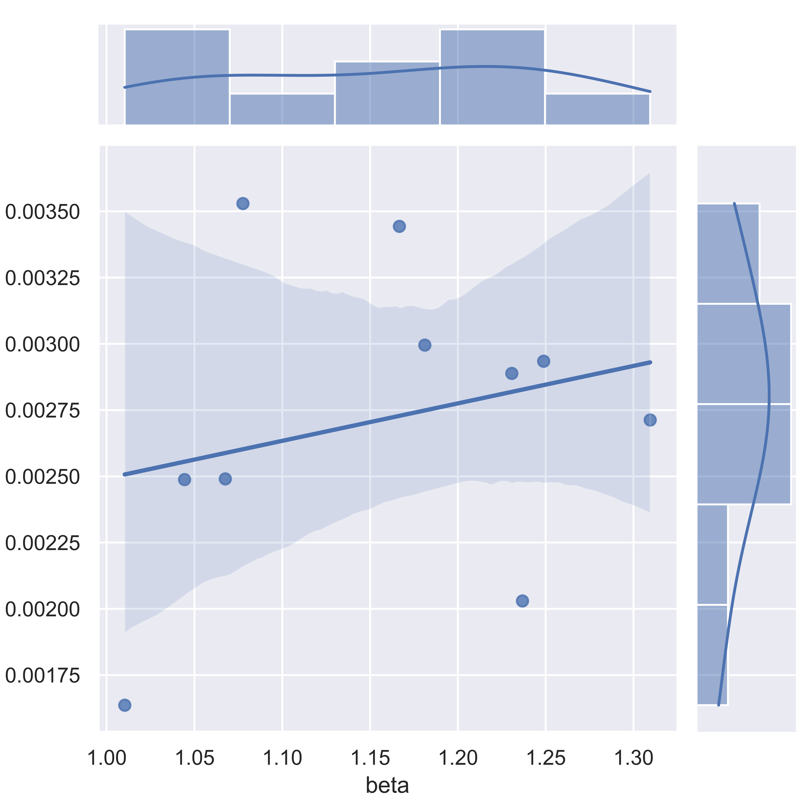
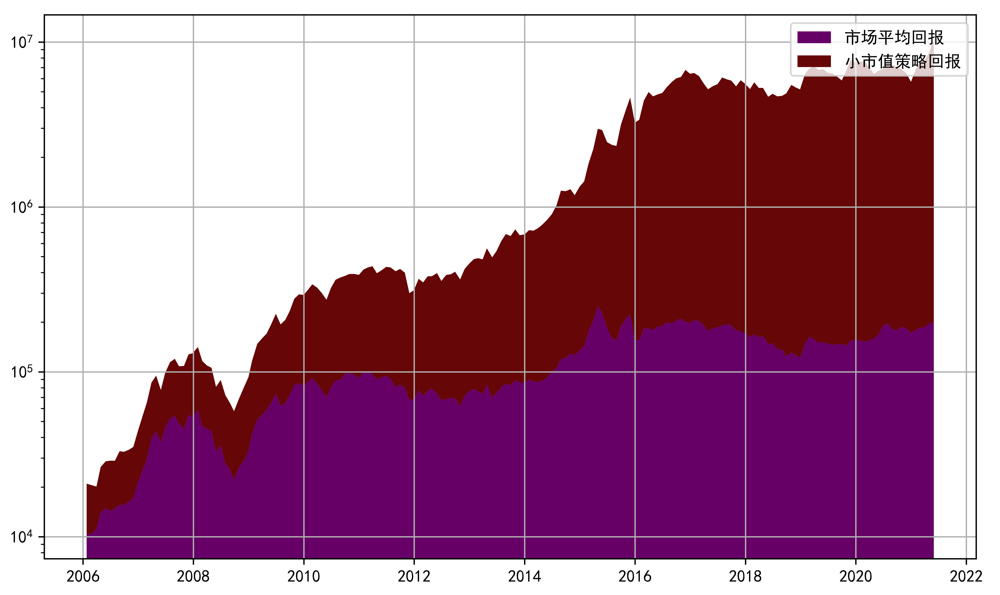
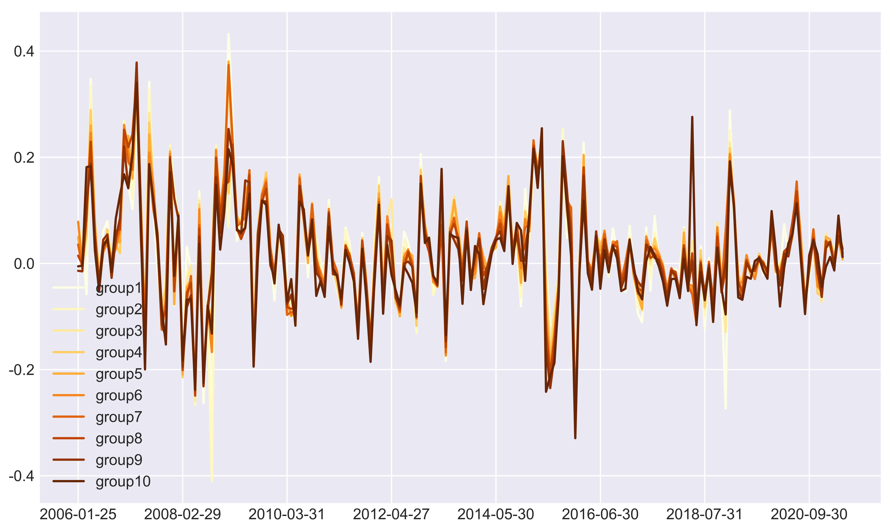
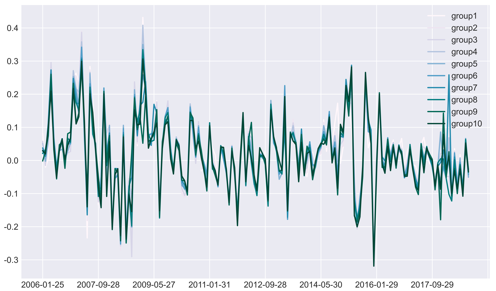

## Results Overview

- CAPM fitting of the last-step Fama-MacBeth:

  

- Small MV effects:

  

- Small MV effects cumulative:

  

- Small MV strategy:

  
  
  
- Small MV strategy, compared with benchmark:

  

- Momentum effects:

  

- Momentum effects cumulative:

  
  
- PB effects:

  

- PB effects cumulative:

  
  
  

