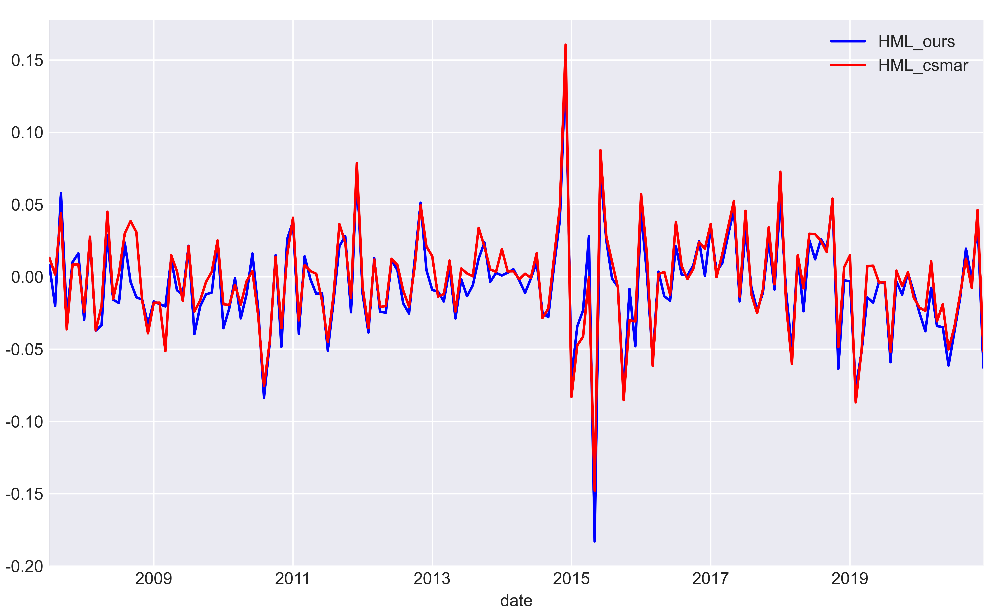
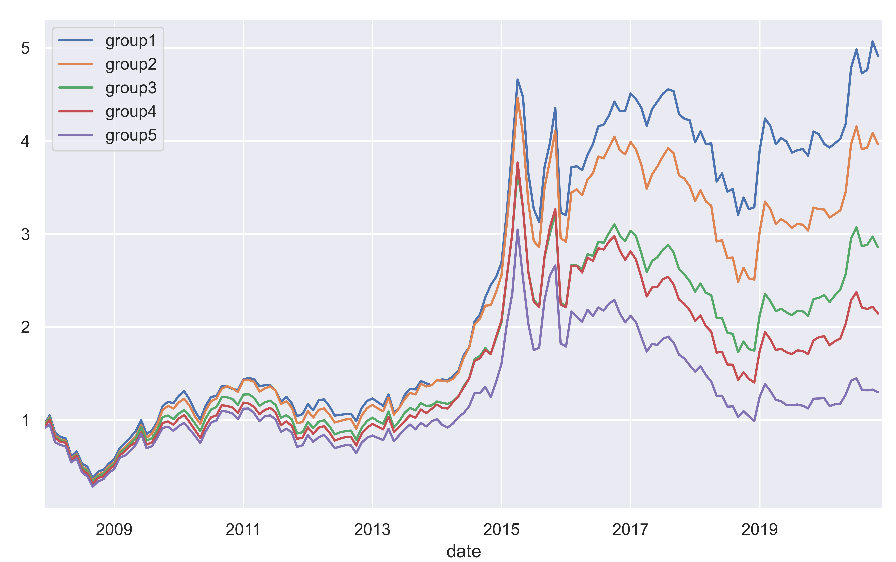
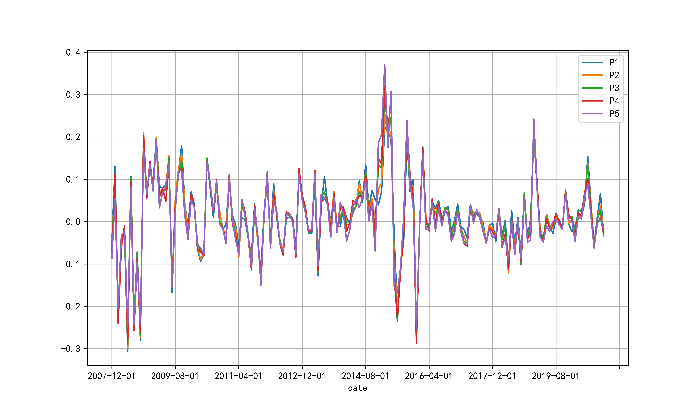
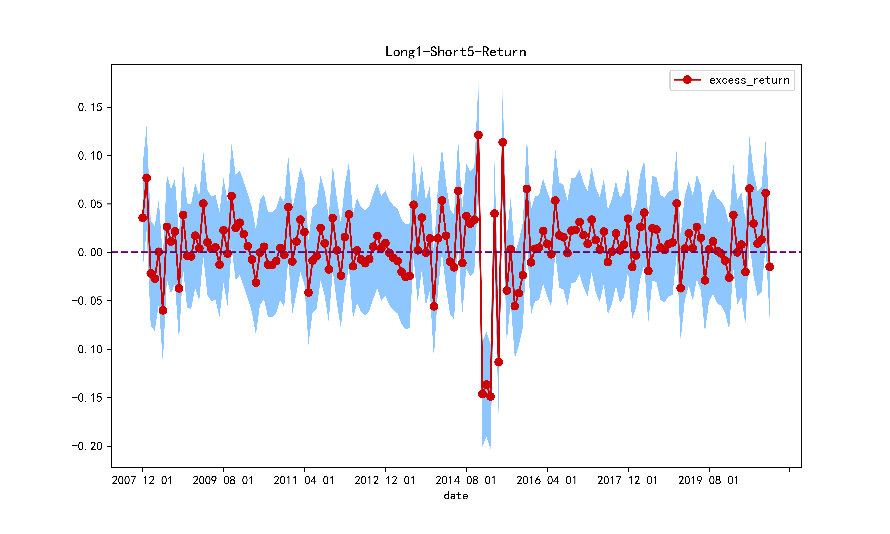
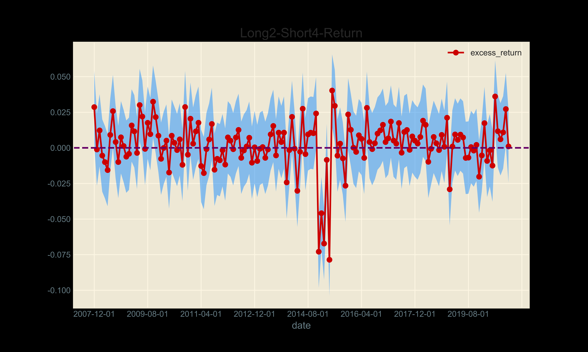
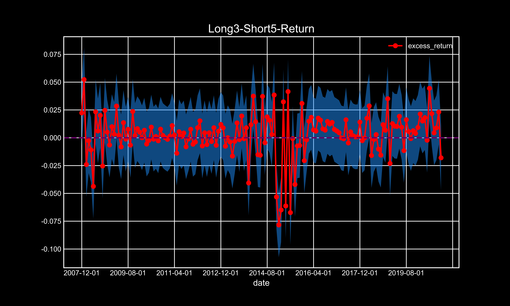
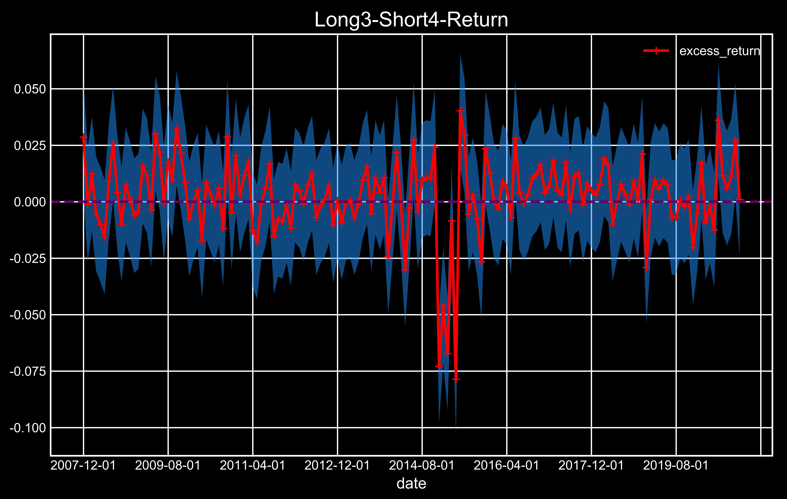
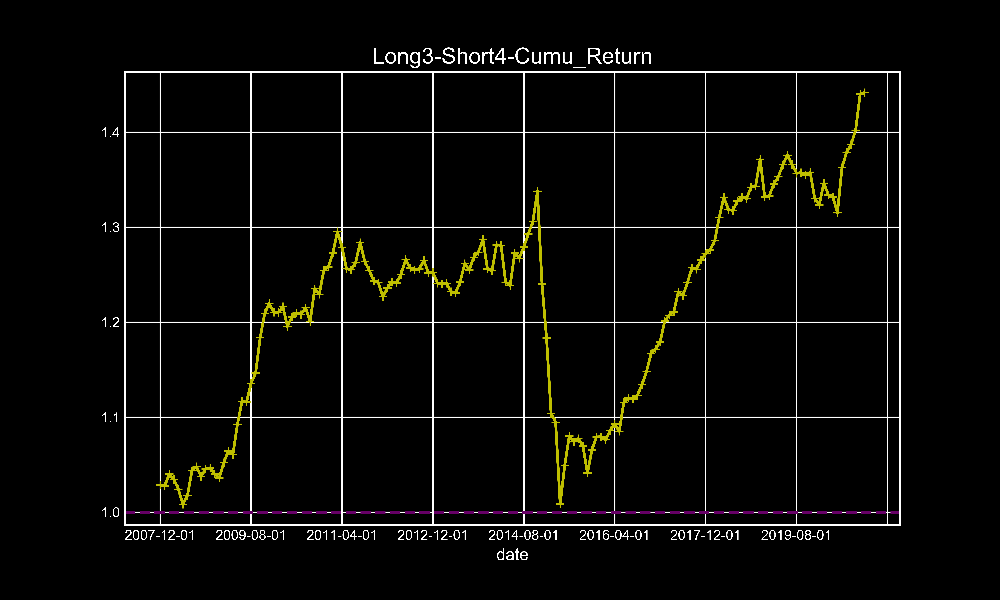

## Results Overview

- HML compare:

  

- Grouped performance by idiosyncratic volatility:

  

- Tracking portfolios return:

  

- Portfolio 1-5 long-short arbitrage return:

  

- Portfolio 2-4 long-short arbitrage return:

  

  - Portfolio 3-5 long-short arbitrage return:

  
 
- Portfolio 3-4 long-short arbitrage return:

  

- Portfolio 3-4 long-short arbitrage return cumulative:

  
  
