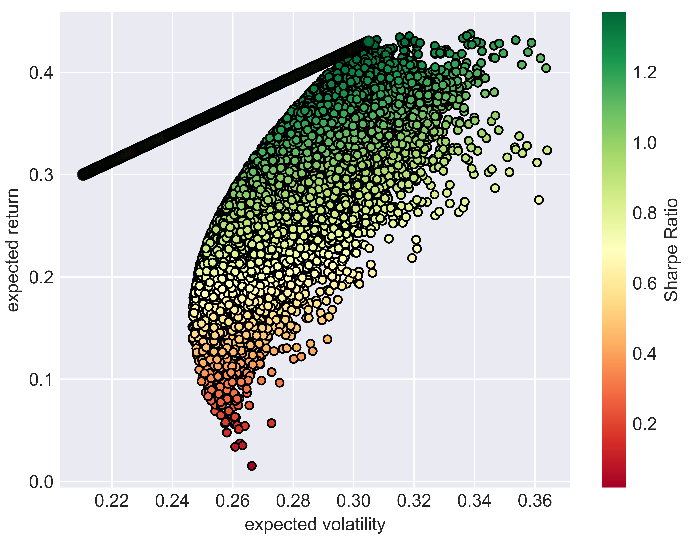
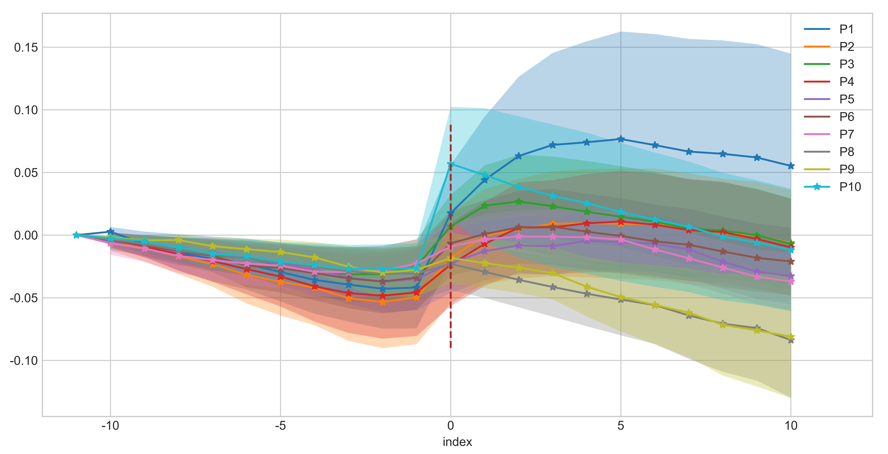

# Empirical Finance Projects
A series of quantitative and empirical studies in China A-share market. Perfect for beginners to learn about empirical finance and investment analysis. Check respective folders to learn about detailed instructions.

#### Preliminary: Numerical Monte Carlo - Efficient Frontier, Capital Market Line, and Sharpe Ratios

#### Project 1: CAPM Applicability and Factor Testing Framework
- Test CAPM applicability using time series and Fama-MacBeth Regression
- Backtest effectiveness of market value, PB ratio, momentum, and contrarian factor by constructing portfolios

#### Project 2: Empirical Study on Arbitrage Pricing Theory
- Replicate size (SMB) and value (HML) factor in Fama-French three factor model in Chinese stock market
- Explore the effect of idiosyncratic volatility on stock returns by examining long-short arbitrage significance

#### Project 3: Verification of Efficient Market Hypothesis Using Event-Study
- Analyze market reaction to private placements (the most typical type of Seasoned Equity Offering) using event study methdology
- Further explore characteristics of stocks with high cumulative abnormal return including industry, ROE, PB and PE ratio, and market value

